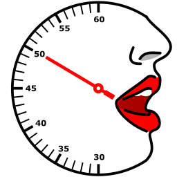
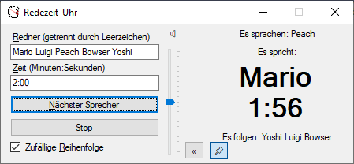
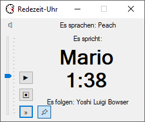
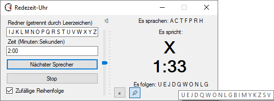

# Redezeit-Uhr

Ein kleines Werkzeug für Meeting, das dem Moderator von Besprechungen hilft, die Redezeit von Teilnehmern zu begrenzen.

Funktionen:

* Beliebig viele Teilnehmer. Gedacht ist das Tool allerdings für kleine Besprechungen mit ca. 5 Teilnehmern.
* angegebene oder zufällige Reihenfolge der Redner. Vermeiden Sie Kritik an Ihrer Moderationskunst wie z.B. "Ich bin immer der erste" oder "Ich bin immer der letzte".
* sekundengenaue Festlegung der Redezeit
* Anzeige der verbleibenden Redezeit
  * wechselt zu orange, wenn 3/4 der Redezeit aufgebraucht ist
  * wechselt zu rot, wenn die Redezeit überschritten wurde
* Abspielen einer Melodie, wenn 3/4 der Redezeit aufgebraucht ist und weniger als 60 Sekunden verbleiben
* Lautstärkeregler für die Melodie
* Stop-Funktion für den Moderator, z.B. zur Zusammenfassung des Gesagten und Aufruf des nächsten Redners.
* immer im Vordergrund, z.B. um nebenher ein Protokoll schreiben zu können. Diese Funktion ist natürlich abschaltbar.
* Verkleinerungsfunktion für mehr Platz auf dem Bildschirm
* Ordentliche Tab-Reihenfolge (das ist heutzutage ja erwähnenswert)
* Unterstützung für Tastaturbedienung

## Gut zu wissen

Die Teilnehmer werden durch Leerzeichen getrennt. D.h. es können keine vollen Namen (Vorname und Nachname) eingegeben werden, sondern wahlweise Vorname oder Nachname oder Rufname (Spitzname) oder Kürzel. In den meisten mir bekannten Firmen gibt es Kürzel. Diese eignen sich gut, weil man dann auch nicht so viel tippen muss.

Bei sehr vielen Teilnehmern kann die Liste in "Es sprachen" bzw. "Es folgen" abgeschnitten dargestellt werden. Der Tooltip liefert die komplette Liste:

## Tastenkombinationen

* Alt+N: nächster Redner
* Alt+S: Stop
* Alt+R: Eingabe der Redner
* Alt+Z: Eingabe der Zeit

## Bekannte Fehler

Der Lautstärkeregler beeinflusst die Systemlautstärke anstatt lediglich die Lautstärke der Programms.

